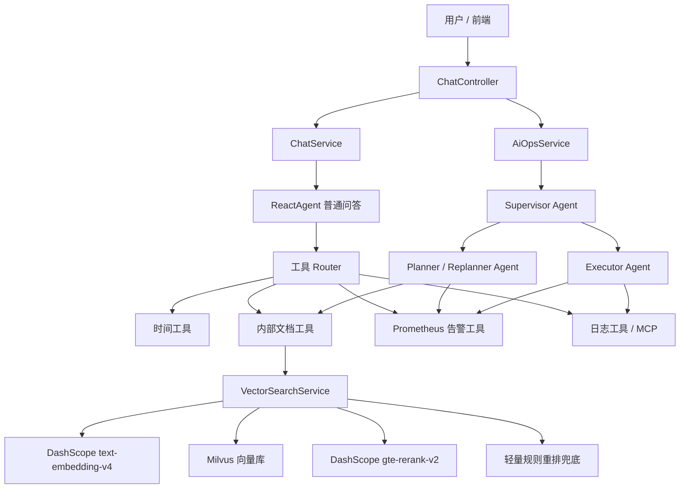

# SuperBizAgent 项目理解与面试准备文档

> 适用目标：帮助你快速理解项目、能在简历和面试中讲清楚“为什么做、怎么做、遇到什么问题、怎么兜底、怎么评估”。

## 1. 一句话介绍项目

SuperBizAgent 是一个基于 Spring Boot、Spring AI Alibaba、DashScope、Milvus 和多 Agent 编排实现的企业智能助手项目，核心能力包括：

- 普通智能问答：支持多轮对话、SSE 流式输出、工具调用和会话记忆。
- RAG 知识库问答：支持上传内部文档、文档分片、向量化入库、Milvus 检索、rerank 精排和工具化查询。
- AIOps 智能排障：通过 Supervisor、Planner、Executor 多 Agent 协作，自动查询告警、检索内部排障文档、查询日志，并生成告警分析报告。

面试时可以这样开场：

> 这个项目不是单纯做一个聊天机器人，而是把企业运维排障流程 Agent 化。传统监控系统只能告诉你“哪里报警了”，但排障还需要人工在 Prometheus、日志平台和内部文档之间来回切换。我这个项目把告警查询、日志检索、知识库检索和报告生成串成一个自动化流程，让 Agent 能按“规划、执行、再规划”的方式完成排障分析。

## 2. 项目解决的业务痛点

### 2.1 为什么选择 AIOps 场景

企业运维排障有几个典型痛点：

1. 信息分散  
   告警在 Prometheus，日志在 CLS 或日志平台，处理 SOP 在内部文档里，排障时需要人工切换多个系统。

2. 经验依赖强  
   同一个 HighCPUUsage、HighMemoryUsage、SlowResponse 告警，不同工程师处理经验不同，新人很难快速定位问题。

3. 告警信息不足  
   监控系统通常只给出指标异常，比如 CPU 超过 80%、P99 响应时间超过 3 秒，但不会自动告诉你可能原因和处理步骤。

4. 工具调用容易失败  
   日志查询、监控查询、知识库检索都可能返回空、超时或失败，如果 Agent 不做兜底，就容易编造结论。

因此这个项目的核心价值是：

- 将“告警理解、知识检索、日志/指标查询、根因分析、修复建议”串成自动化闭环。
- 用 RAG 让 Agent 参考内部文档，减少凭空生成。
- 用 Planner-Executor-Replanner 结构提升复杂排障任务的可控性。
- 对工具调用失败、rerank 失败、无检索结果等场景做降级，提升鲁棒性。

## 3. 技术栈

| 模块 | 技术 |
| --- | --- |
| 后端框架 | Spring Boot 3.2.0 |
| 语言 | Java 17 |
| Agent 框架 | Spring AI Alibaba Agent Framework |
| 大模型服务 | 阿里云 DashScope |
| 向量化模型 | DashScope `text-embedding-v4` |
| Rerank 模型 | DashScope `gte-rerank-v2` |
| 向量数据库 | Milvus 2.6.10 |
| 对话模型 | DashScope ChatModel |
| 日志/告警工具 | Prometheus API、CLS Mock/MCP 工具 |
| 流式输出 | Spring `SseEmitter` |
| 文件上传 | Spring MultipartFile |

## 4. 项目整体架构



## 5. 核心接口

### 5.1 普通非流式对话

接口：

```http
POST /api/chat
```

作用：

- 创建或获取会话。
- 构造系统 Prompt。
- 根据问题路由工具。
- 创建 ReactAgent。
- 调用 `agent.call(question)`。
- 保存会话历史。

适合回答普通问题、知识库问答、查询告警等。

### 5.2 SSE 流式对话

接口：

```http
POST /api/chat_stream
```

作用：

- 使用 `SseEmitter` 返回流式内容。
- 通过 `agent.stream(question)` 逐步输出模型生成内容。
- 监听 `AGENT_MODEL_STREAMING`、`AGENT_TOOL_FINISHED` 等事件。
- 完成后保存完整回答到会话历史。

面试可讲点：

> 流式接口提升用户体验，尤其是 Agent 调工具时耗时较长，SSE 可以先把模型输出和阶段性结果推给前端，避免用户长时间无反馈。

### 5.3 AIOps 智能运维接口

接口：

```http
POST /api/ai_ops
```

作用：

- 创建低温度、大 token 的 ChatModel。
- 获取工具回调。
- 调用 `AiOpsService.executeAiOpsAnalysis()`。
- 输出最终 Markdown 告警分析报告。

### 5.4 文档上传接口

接口：

```http
POST /api/upload
```

作用：

- 只允许 `.txt`、`.md` 文件。
- 文件保存到上传目录。
- 保存后自动调用 `VectorIndexService.indexSingleFile()` 创建向量索引。
- 如果索引失败，目前文件仍上传成功，但日志会记录失败。

这是一个可以被面试官追问的点：生产环境中应该让上传接口返回更明确的索引状态，或者引入异步索引任务和状态查询接口。

### 5.5 RAG 调试接口

接口：

```http
GET /api/rag/debug/search?query=xxx
GET /api/rag/debug/compare?query=xxx
```

作用：

- `/search`：直接查看当前优化后的检索结果。
- `/compare`：对比 baseline 单路向量检索和当前 query expansion + rerank 的结果。

这个接口用于评估 RAG 优化是否有效。

## 6. 普通对话链路

普通问答主要在 `ChatController` 和 `ChatService` 中完成。

链路如下：

```text
用户请求
→ ChatController 接收 /api/chat 或 /api/chat_stream
→ 获取 SessionInfo
→ ChatService 创建/复用 DashScopeApi 和 ChatModel
→ 构造包含会话摘要和最近历史的 systemPrompt
→ 根据用户问题做工具 Router
→ 创建或复用 ReactAgent
→ Agent 自动选择工具并生成回答
→ 更新会话历史
→ 返回普通响应或 SSE 流式响应
```

### 6.1 会话记忆

项目里有两层记忆：

- 最近窗口：保留最近若干轮用户和 AI 对话。
- 滚动摘要：较早历史会被压缩成摘要，避免 Prompt 过长。

配置：

```yaml
chat:
  memory:
    max-window-size: 6
    summary-max-chars: 3000
```

面试回答：

> 我没有把全部历史都塞进 Prompt，而是保留最近对话窗口，同时把更早的上下文压缩成摘要。这样既能维持多轮上下文连续性，也能控制 token 消耗。系统 Prompt 里也明确要求“最近对话优先，摘要只作为远期上下文”。

### 6.2 工具 Router

项目里根据用户问题关键词做工具路由：

| 路由 | 场景 | 挂载工具 |
| --- | --- | --- |
| `CHAT_ONLY` | 普通闲聊 | 不挂载或少挂载工具 |
| `DATETIME` | 时间日期问题 | 时间工具 |
| `DOCS_RAG` | 文档、流程、排障 SOP | 内部文档工具 |
| `OBSERVABILITY` | 告警、指标、日志 | Prometheus / 日志工具 |
| `AIOPS_PARTIAL` | 文档 + 告警或日志 | 部分运维工具 |
| `AIOPS_FULL` | 文档 + 指标 + 日志 | 完整排障工具 |

为什么要做 Router：

- 避免简单问题挂载全部工具，导致 Agent 误调用。
- 减少工具 schema 注入 Prompt 的 token。
- 提高响应速度和执行稳定性。
- 面试中能体现你对 Agent 工程化的理解。

## 7. RAG 知识库链路

RAG 是本项目最重要的工程亮点之一。它不是单独给用户暴露一个问答接口，而是作为 `queryInternalDocs` 工具挂到 Agent 中。

### 7.1 文档入库链路

```text
上传 .txt/.md 文件
→ FileUploadController 保存文件
→ VectorIndexService 读取文件内容
→ 删除同文件旧索引
→ DocumentChunkService 文档分片
→ VectorEmbeddingService 调 DashScope text-embedding-v4
→ VectorIndexService 写入 Milvus
```

### 7.2 文档分片策略

`DocumentChunkService` 的分片逻辑：

1. 优先按 Markdown 标题切分。
2. 每个章节如果超过最大长度，再按段落切分。
3. 每个 chunk 增加标题上下文：

```text
标题: xxx

正文内容...
```

4. 相邻 chunk 之间保留 overlap。

配置：

```yaml
document:
  chunk:
    max-size: 800
    overlap: 100
```

为什么这样做：

- 标题进入 chunk 内容可以提升标题类问题的召回率。
- 按段落切分比固定长度硬切更能保留语义完整性。
- overlap 可以减少答案跨 chunk 时的信息断裂。

### 7.3 向量化与 Milvus

向量模型：

```yaml
dashscope:
  embedding:
    model: text-embedding-v4
```

Milvus 检索：

- 使用 L2 距离。
- `score` 越小表示越相似。
- 检索时先召回 `candidate-k` 个候选，再做过滤和重排。

当前配置：

```yaml
rag:
  top-k: 3
  candidate-k: 24
  max-distance: 0
```

解释：

- `candidate-k=24`：Milvus 粗召回更多候选，给 rerank 精排留空间。
- `top-k=3`：最终只把 3 个最相关 chunk 注入 Prompt，减少噪声。
- `max-distance=0`：默认不启用距离过滤，避免阈值不准导致误杀。

### 7.4 Query Expansion

`VectorSearchService` 会对常见运维问题做轻量 query expansion。

例如：

- 用户问 CPU，扩展为 `CPU 使用率过高 high cpu usage 进程排查`。
- 用户问 OOM，扩展为 `内存使用率过高 memory high usage OOM 排查`。
- 用户问响应慢，扩展为 `响应慢 slow response timeout 延迟排查`。

目的：

- 用户表达和文档表达可能不一致。
- 多路召回可以减少漏召回。
- 这是一个低成本、可解释的优化。

## 8. Rerank 独立重排模型

### 8.1 为什么要接 rerank

只用 Milvus 向量距离会遇到几个问题：

1. 向量召回是粗粒度相似，不一定把最有用的排障 chunk 排在最前。
2. 运维问题有很多同义表达，比如“接口慢”“P99 升高”“timeout”“响应延迟”。
3. 如果 topK 太小，相关文档可能被排到后面进不了 Prompt。
4. 如果 topK 太大，会把噪声文档塞给模型，增加幻觉风险。

所以现在链路改成：

```text
Milvus 粗召回 candidate-k=24
→ DashScope gte-rerank-v2 语义精排
→ 选 top-k=3 注入 Prompt
```

### 8.2 当前实现

新增了：

- `RerankService`：重排接口。
- `DashScopeRerankService`：调用 DashScope `DashScopeRerankModel`。
- `RagProperties.rerank`：配置开关、模型名、是否返回文档。

配置：

```yaml
rag:
  rerank:
    enabled: true
    model: "gte-rerank-v2"
    return-documents: true
```

### 8.3 Rerank 失败兜底

如果发生以下情况：

- rerank 服务不可用。
- 模型名没开通。
- 网络超时。
- 返回结果为空。
- 文档映射失败。

项目不会直接失败，而是降级到本地轻量规则重排：

```text
rerankScore = vectorScore + contentHits * 0.08 + metadataHits * 0.15
vectorScore = 1 / (1 + L2距离)
```

本地重排考虑：

- 向量相似度。
- query 关键词在正文中的命中。
- query 关键词在 metadata 中的命中。

面试回答：

> 我没有把 RAG 链路完全依赖 rerank 服务。因为模型服务可能失败或超时，所以我保留了本地轻量重排作为 fallback。正常情况下用 `gte-rerank-v2` 做语义精排，失败时用向量相似度、正文关键词命中和 metadata 命中做可解释排序，保证知识库检索能力不会因为 rerank 服务异常直接不可用。

## 9. AIOps 多 Agent 链路

AIOps 是项目最适合写在简历上的核心亮点。

### 9.1 整体流程

```text
/api/ai_ops
→ ChatController 创建 ChatModel
→ AiOpsService 构建 Planner Agent
→ AiOpsService 构建 Executor Agent
→ SupervisorAgent 调度 Planner 和 Executor
→ Planner 拆解告警排障计划
→ Executor 执行第一步工具调用
→ Planner 根据反馈重新规划
→ 最终输出 Markdown 告警分析报告
```

### 9.2 三类 Agent 的职责

#### Supervisor Agent

职责：

- 调度 Planner 和 Executor。
- 判断什么时候继续规划、什么时候执行、什么时候结束。
- 发现连续失败时终止流程，要求输出无法完成的原因。

#### Planner / Replanner Agent

职责：

- 分析告警任务。
- 决定下一步是 `PLAN`、`EXECUTE` 还是 `FINISH`。
- 根据 Executor 反馈调整后续步骤。
- 最终输出完整 Markdown 报告。

#### Executor Agent

职责：

- 只执行 Planner 给出的第一步。
- 调用 Prometheus、日志、内部文档等工具。
- 把执行状态、证据、失败原因返回给 Planner。

### 9.3 为什么不是一个 Agent 直接做完

如果一个 Agent 同时负责规划、执行和总结，容易出现：

- 一次性计划太长，中途失败后难以修正。
- 工具调用结果被忽略。
- 模型直接编造“已查询到”的结果。
- 难以控制输出格式。

拆成 Planner 和 Executor 后：

- Planner 负责思考和调整。
- Executor 负责执行和收集证据。
- Supervisor 负责流程控制。

面试回答：

> 我把复杂排障任务拆成 Planner、Executor 和 Supervisor，是为了让 Agent 的行为更可控。Planner 只负责拆解和再规划，Executor 只执行一步并反馈证据，Supervisor 决定是否继续迭代。这样比单 Agent 一次性完成更容易处理工具失败和中间结果变化。

## 10. 工具体系

### 10.1 内部文档工具

工具名：

```text
queryInternalDocs
```

作用：

- 查询内部知识库。
- 返回结构化 JSON。
- 包含 source、fileName、chunkIndex、title、distance、rerankScore、matchedQuery、content。

这能让 Agent 更容易引用来源，而不是只拿到一段无结构文本。

### 10.2 Prometheus 告警工具

工具名：

```text
queryPrometheusAlerts
```

作用：

- 查询当前活跃告警。
- 支持 mock 模式。
- mock 数据包括 HighCPUUsage、HighMemoryUsage、SlowResponse。

真实模式会请求：

```text
{prometheus.base-url}/api/v1/alerts
```

### 10.3 日志工具

工具名：

```text
getAvailableLogTopics
queryLogs
```

支持的日志主题：

- `system-metrics`
- `application-logs`
- `database-slow-query`
- `system-events`

日志工具的亮点：

- 查询前可以先获取主题列表，减少 Agent 不知道查什么。
- region 做了约束，默认 `ap-guangzhou`。
- mock 日志和告警类型有关联，便于演示完整排障流程。

### 10.4 时间工具

用于处理时间、日期相关问题。

## 11. 可靠性设计

### 11.1 工具调用失败兜底

项目里多处强调：

- 工具返回失败要记录原因。
- 工具连续 3 次失败或返回空，要停止该方向。
- 最终报告必须诚实说明无法完成的原因。
- 禁止编造未查询到的数据。

面试可讲：

> Agent 项目最容易被质疑的是幻觉问题，所以我在 Prompt 和流程里都要求工具失败时不能编造结论。Executor 会把失败原因和请求参数反馈给 Planner，Planner 再决定是否换方向、降级或在最终报告中说明无法完成。

### 11.2 RAG 失败兜底

- 文档检索为空：返回 `no_results`。
- 检索异常：返回 error JSON。
- rerank 失败：降级为本地轻量重排。
- 低置信结果：通过 `confidenceLevel` 和 `qualityReason` 标记。

### 11.3 Agent 缓存

`ChatService` 缓存：

- DashScopeApi。
- 标准 ChatModel。
- ReactAgent。

目的：

- 避免每次请求重复构造模型和 Agent。
- 降低对象创建开销。

注意：

- Agent 缓存 key 包含 systemPrompt hash 和工具路由摘要。
- 因为历史变化会影响 systemPrompt，所以缓存有上限，超过 128 会清空。

### 11.4 SSE 超时控制

- 普通流式对话超时 5 分钟。
- AIOps 分析超时 10 分钟。

## 12. 当前项目的不足和可以诚实说明的优化方向

面试时不要把项目说成完美，能说出不足反而更像真的做过。

### 12.1 RAG 评估还可以加强

当前有 `/api/rag/debug/compare`，能看 baseline 和优化结果差异，但还没有完整评测集。

优化方向：

- 整理 20 到 50 个典型告警问题。
- 标注期望命中文档。
- 统计 Top-K 命中率、人工相关性评分、回答可引用率。
- 对比 `candidate-k=12/24/30`、是否 rerank、不同 chunk size 的效果。

### 12.2 文档上传索引状态不够明确

当前文件上传成功后会尝试索引，如果索引失败，只记录日志，接口仍可能返回上传成功。

优化方向：

- 上传和索引解耦。
- 引入异步任务队列。
- 返回 indexing 状态。
- 提供索引状态查询接口。

### 12.3 日志工具当前主要是 mock

当前 `QueryLogsTools` 在 mock 模式下返回模拟日志；真实模式依赖 MCP 日志工具。

优化方向：

- 接入真实 CLS API。
- 统一日志查询工具返回结构。
- 增加超时、分页、重试和降级。

### 12.4 工具 Router 目前是关键词规则

当前 Router 是关键词匹配，优点是简单、低延迟、可解释；缺点是泛化有限。

优化方向：

- 使用轻量分类模型或 LLM intent classifier。
- 统计路由准确率。
- 允许 Agent 在必要时二次请求工具。

## 13. 简历推荐写法

### 13.1 项目介绍

基于 Spring Boot、Spring AI Alibaba、DashScope、Milvus 与 RAG 构建企业级智能排障 Agent。针对传统监控系统只能提供告警和指标、排障仍需人工切换知识库、日志和监控平台的问题，项目将告警理解、知识检索、日志/指标查询、根因分析和修复建议生成串联为自动化排障流程。

### 13.2 项目亮点

- 设计 Agent 排障执行链路，将用户问题、系统 Prompt、会话历史、知识库检索结果和日志/指标工具统一编排，支持从告警输入到排障建议生成的多步推理流程。
- 构建 RAG 检索链路，基于 DashScope `text-embedding-v4` 完成文本向量化，使用 Milvus 进行多路候选召回，并将 `candidate-k` 提高到 24，为后续精排提供更充分的候选上下文。
- 接入 DashScope `gte-rerank-v2` 独立重排模型，对 Milvus 召回的候选 chunk 进行语义相关性精排，最终选取 Top-K 文档注入 Prompt，提升复杂告警问题下上下文命中质量。
- 设计 rerank 失败兜底机制，当重排模型调用失败、返回为空或服务不可用时，自动降级为本地轻量重排策略，综合向量相似度、正文关键词命中和 metadata 命中进行排序，保障 RAG 链路可用性。
- 引入 Supervisor、Planner、Executor 多 Agent 编排，将复杂排障任务拆解为规划、执行、再规划闭环，并要求工具失败时输出可解释原因，减少 Agent 幻觉式结论。
- 设计工具 Router 机制，将请求划分为 CHAT_ONLY、DOCS_RAG、OBSERVABILITY、AIOPS_PARTIAL、AIOPS_FULL 等类型，避免简单问题触发完整排障流程，降低无效工具调用和 token 消耗。

## 14. 面试官可能问的问题与回答模板

### Q1：你这个项目是做什么的？

答：

> 这是一个企业智能排障 Agent 项目。它主要解决运维排障中信息分散的问题，把 Prometheus 告警、日志查询、内部知识库检索和最终报告生成串成一个自动化流程。普通问题走 ReactAgent 工具调用，复杂告警分析走 Supervisor、Planner、Executor 多 Agent 编排。

### Q2：为什么不用现成的监控工具？

答：

> 监控工具通常解决的是“发现异常”，比如告诉我们 CPU 高、内存高、P99 延迟高，但真正排障还需要查日志、查 SOP、结合上下文判断根因。这个项目不是替代 Prometheus，而是在 Prometheus、日志平台和内部知识库之上加一层 Agent 编排，让它能自动完成排障流程。

### Q3：RAG 在你的项目里具体怎么走？

答：

> 文件上传后会被分片，分片时优先按 Markdown 标题和段落切分，并把标题补到 chunk 内容里。每个 chunk 用 DashScope `text-embedding-v4` 向量化后写入 Milvus。用户或 Agent 查询内部文档时，先做 query expansion，再用 Milvus 召回 `candidate-k=24` 个候选，之后用 `gte-rerank-v2` 做语义重排，最后取 `top-k=3` 注入 Prompt。

### Q4：你们的 rerank 模型是什么？

答：

> 当前接的是 DashScope `gte-rerank-v2`。它不替代向量检索，而是作为精排层。Milvus 负责粗召回，rerank 模型负责对候选 chunk 做语义相关性排序。

### Q5：为什么不直接用向量相似度？

答：

> 向量相似度适合粗召回，但复杂运维问题里有很多同义表达，比如“响应慢”“P99 升高”“timeout”。只看向量距离可能把真正有用的 SOP 排在后面。rerank 可以在召回候选里进一步判断 query 和文档的语义相关性，提高最终进入 Prompt 的上下文质量。

### Q6：rerank 服务失败怎么办？

答：

> 我保留了本地轻量重排作为 fallback。模型重排失败时，会降级为向量相似度、正文关键词命中和 metadata 命中的综合打分。这样即使 rerank 服务不可用，RAG 链路也不会整体失败。

### Q7：你怎么评估 RAG 效果？

答：

> 项目里提供了 `/api/rag/debug/compare`，可以对比 baseline 单路向量检索和优化后的 query expansion + rerank 检索结果，包括重合结果、新召回结果、被替换结果、平均距离和平均 rerankScore。更完整的评估方式是构建一组典型告警问题，标注期望命中文档，然后统计 Top-K 命中率、人工相关性评分和回答可引用率。

### Q8：文档分片为什么这么做？

答：

> 我优先按 Markdown 标题切分，再按段落切分，避免固定长度硬切破坏语义。chunk 内容里会显式加入标题，比如“标题: CPU 使用率过高排查”，这样标题类问题和运维术语更容易被召回。同时使用 overlap 防止跨 chunk 信息断裂。

### Q9：Agent 为什么要做工具 Router？

答：

> 如果所有问题都挂载全部工具，工具 schema 会增加 token，Agent 也更容易误调用。Router 根据问题意图只挂载相关工具，比如普通聊天走 CHAT_ONLY，文档问题走 DOCS_RAG，告警排障走 AIOPS_FULL。这样能减少无效工具调用，也能提升响应速度和稳定性。

### Q10：多 Agent 是怎么协作的？

答：

> AIOps 链路里有 Supervisor、Planner 和 Executor。Planner 负责拆解任务和再规划，Executor 只执行 Planner 给出的第一步并返回证据，Supervisor 负责调度两者直到完成。这样可以把复杂排障任务拆成可控步骤，而不是让一个 Agent 一次性编完整个报告。

### Q11：Planner-Executor-Replanner 有什么价值？

答：

> 运维排障不是固定流程，工具返回结果会影响下一步。例如查到 CPU 高后，可能要查进程和日志；如果日志没结果，就要转向指标或文档。Planner-Executor-Replanner 能根据中间结果动态调整计划，比固定链路更适合复杂环境。

### Q12：如何减少 Agent 幻觉？

答：

> 我主要从三方面做：第一，Prompt 要求所有结论必须基于工具返回；第二，Executor 会把工具结果和失败原因结构化反馈给 Planner；第三，如果同一方向连续失败或返回空，最终报告要明确说明无法完成，而不是编造数据。RAG 工具也返回结构化 source、chunkIndex、rerankScore，方便 Agent 引用依据。

### Q13：日志查询怎么做？

答：

> 项目里有 `getAvailableLogTopics` 和 `queryLogs` 两个工具。查询前可以先获取日志主题，主题包括系统指标、应用日志、数据库慢查询和系统事件。mock 模式下根据告警类型返回关联日志；真实环境可以通过 MCP 或 CLS API 接入。

### Q14：Prometheus 告警工具怎么做？

答：

> `queryPrometheusAlerts` 在真实模式下调用 Prometheus `/api/v1/alerts`，解析当前 active/firing 告警；mock 模式下返回 HighCPUUsage、HighMemoryUsage、SlowResponse 等测试告警，方便演示 AIOps 流程。

### Q15：你项目中最有工程价值的点是什么？

答：

> 我认为是把 RAG、工具调用和多 Agent 编排做成一个可降级的排障链路。不是简单调用大模型，而是考虑了工具路由、rerank 精排、模型失败 fallback、工具失败反馈、会话记忆和 SSE 流式输出这些工程问题。

### Q16：如果让你继续优化，你会做什么？

答：

> 我会优先做三件事。第一，补一套 RAG 评测集，统计 Top-K 命中率和回答可引用率。第二，把文档上传和索引改成异步任务，提供索引状态查询。第三，把日志 mock 替换为真实 CLS API，并统一工具超时、重试和失败补偿策略。

### Q17：你的项目有什么不足？

答：

> 当前不足主要有三个。第一，RAG 评估还不够系统，虽然有 debug compare 接口，但还缺少人工标注评测集。第二，上传接口对索引失败的状态返回不够明确。第三，工具 Router 目前是关键词规则，优点是可解释和低延迟，但泛化能力不如模型分类。

## 15. 面试讲述顺序建议

如果面试官让你介绍项目，建议按这个顺序说：

1. 业务背景  
   传统监控只能发现异常，排障要切换告警、日志、知识库。

2. 总体架构  
   Spring Boot 后端 + Spring AI Alibaba Agent + DashScope + Milvus。

3. 普通对话和工具调用  
   ReactAgent、工具 Router、会话记忆、SSE。

4. RAG 链路  
   上传、分片、embedding、Milvus、query expansion、rerank、fallback。

5. AIOps 多 Agent  
   Supervisor、Planner、Executor、Plan-Execute-Replan。

6. 可靠性设计  
   rerank 失败降级、工具失败反馈、连续失败停止、禁止编造。

7. 评估与不足  
   debug compare、未来评测集、异步索引、真实日志接入。

## 16. 你需要重点背熟的关键词

- Agent 不是简单聊天，而是工具编排。
- Prometheus 发现异常，Agent 负责排障编排。
- Milvus 粗召回，`gte-rerank-v2` 精排。
- Rerank 失败自动 fallback 到本地轻量重排。
- Planner 负责规划，Executor 负责执行，Supervisor 负责调度。
- 工具失败不能编造，要记录失败原因并反馈。
- RAG 评估看 Top-K 命中率、人工相关性、回答可引用率。
- 工具 Router 减少无效工具调用和 token 消耗。

## 17. 一分钟项目介绍稿

> 我做的是一个企业级智能排障 Agent 项目，基于 Spring Boot、Spring AI Alibaba、DashScope 和 Milvus 实现。项目解决的是传统运维排障中告警、日志和内部文档分散的问题。普通问答通过 ReactAgent 自动选择工具，复杂 AIOps 场景通过 Supervisor、Planner、Executor 多 Agent 协作完成“告警理解、知识检索、日志/指标查询、根因分析、修复建议”的闭环。RAG 方面，我用 DashScope `text-embedding-v4` 做向量化，Milvus 召回候选 chunk，再接入 DashScope `gte-rerank-v2` 做语义重排，同时保留本地轻量重排作为失败兜底。项目重点不是简单调用大模型，而是围绕工具路由、rerank 精排、失败降级、会话记忆和多 Agent 编排做工程化落地。

