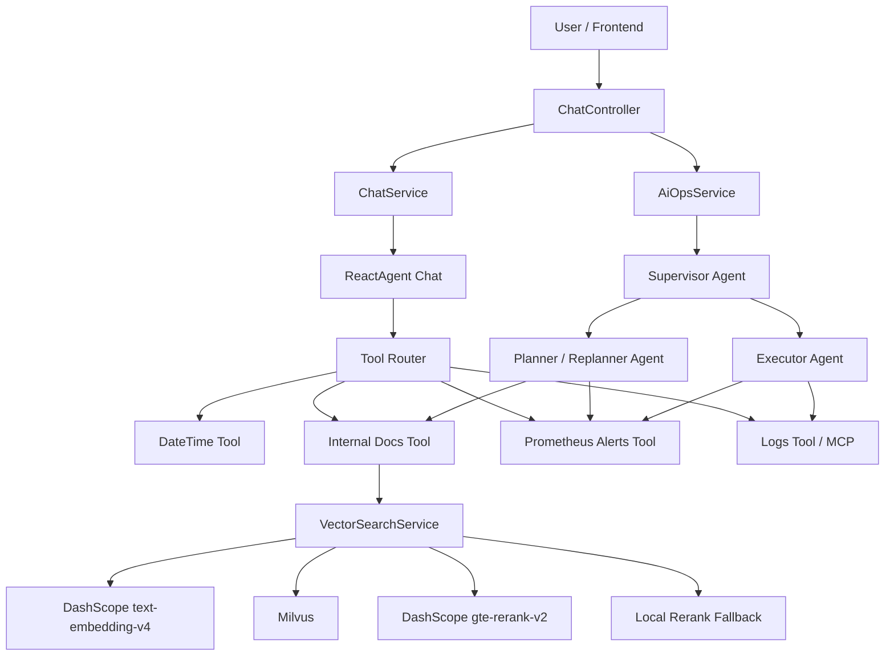

# SuperBizAgent

SuperBizAgent is an enterprise AIOps Agent demo built with Spring Boot, Spring AI Alibaba, DashScope, Milvus, and RAG. It turns alert investigation into an agent workflow: alert understanding, internal knowledge retrieval, log/metric querying, root-cause analysis, and remediation report generation.

中文简介：这是一个企业级智能排障 Agent 项目，用于演示如何把 Prometheus 告警、日志查询、内部文档知识库和多 Agent 编排组合成自动化排障流程。

## Features

- RAG knowledge base: upload Markdown/text documents, chunk them, embed them with DashScope `text-embedding-v4`, and store vectors in Milvus.
- Semantic reranking: retrieve candidates from Milvus, then rerank with DashScope `gte-rerank-v2`; fallback to local lightweight rerank when the model call fails.
- AIOps multi-agent workflow: use Supervisor, Planner/Replanner, and Executor agents to run a plan-execute-replan troubleshooting loop.
- Tool calling: internal docs search, Prometheus alert querying, log querying, and datetime tools.
- Tool router: route user questions to relevant tools only, reducing unnecessary tool calls and prompt cost.
- Conversation memory: keep recent turns and summarized long-term context.
- SSE streaming: stream normal chat and AIOps reports to the frontend.
- Debug endpoints: compare baseline vector retrieval with optimized query expansion + rerank results.

## Architecture



## Tech Stack

| Area | Technology |
| --- | --- |
| Language | Java 17 |
| Backend | Spring Boot 3.2.0 |
| Agent framework | Spring AI Alibaba Agent Framework |
| LLM provider | Alibaba Cloud DashScope |
| Embedding model | `text-embedding-v4` |
| Rerank model | `gte-rerank-v2` |
| Vector database | Milvus 2.6.10 |
| Streaming | Server-Sent Events with `SseEmitter` |
| Build tool | Maven |

## Core Modules

```text
src/main/java/org/example
├── Main.java
├── agent/tool
│   ├── DateTimeTools.java          # Datetime tool
│   ├── InternalDocsTools.java      # RAG internal documentation tool
│   ├── QueryLogsTools.java         # CLS/mock log query tool
│   └── QueryMetricsTools.java      # Prometheus alert query tool
├── config
│   ├── RagProperties.java          # RAG and rerank configuration
│   ├── MilvusConfig.java
│   └── DocumentChunkConfig.java
├── controller
│   ├── ChatController.java         # Chat, streaming, AIOps APIs
│   ├── FileUploadController.java   # Document upload and indexing
│   └── RagDebugController.java     # RAG search/compare debug APIs
└── service
    ├── AiOpsService.java           # Supervisor/Planner/Executor workflow
    ├── ChatService.java            # ReactAgent, tool router, memory
    ├── DocumentChunkService.java   # Markdown/paragraph chunking
    ├── VectorEmbeddingService.java # DashScope embedding
    ├── VectorIndexService.java     # File indexing into Milvus
    ├── VectorSearchService.java    # Query expansion, retrieval, rerank
    ├── RerankService.java
    └── DashScopeRerankService.java
```

## RAG Pipeline

### Indexing

```text
Upload .txt/.md file
-> FileUploadController saves the file
-> VectorIndexService reads content
-> DocumentChunkService chunks by Markdown headings and paragraphs
-> VectorEmbeddingService calls DashScope text-embedding-v4
-> VectorIndexService writes vectors and metadata into Milvus
```

### Retrieval

```text
User / Agent query
-> Lightweight query expansion for AIOps terms
-> Milvus recalls candidate-k documents
-> DashScope gte-rerank-v2 reranks candidates
-> Fallback to local rerank if model rerank fails
-> Top-K chunks are returned to the Agent
```

Current default configuration:

```yaml
rag:
  top-k: 3
  candidate-k: 24
  max-distance: 0
  rerank:
    enabled: true
    model: "gte-rerank-v2"
    return-documents: true
```

Local fallback rerank combines vector similarity, content keyword hits, and metadata keyword hits:

```text
rerankScore = vectorScore + contentHits * 0.08 + metadataHits * 0.15
vectorScore = 1 / (1 + L2 distance)
```

## AIOps Agent Workflow

The AIOps workflow is implemented in `AiOpsService` with three roles:

- Supervisor Agent: controls whether to call Planner, Executor, or finish.
- Planner/Replanner Agent: decomposes alert investigation tasks and adjusts the plan based on execution feedback.
- Executor Agent: executes one step at a time, calls tools, and returns structured evidence.

Workflow:

```text
POST /api/ai_ops
-> Supervisor starts orchestration
-> Planner creates the troubleshooting plan
-> Executor runs the first step and collects evidence
-> Planner replans based on evidence
-> Repeat until FINISH
-> Generate a Markdown alert analysis report
```

The prompts explicitly require the agents to avoid hallucination: if a tool repeatedly fails or returns no data, the final report must explain what could not be completed instead of inventing evidence.

## API Overview

### Chat

```http
POST /api/chat
Content-Type: application/json

{
  "Id": "session-001",
  "Question": "How should I troubleshoot high CPU usage?"
}
```

### Streaming Chat

```http
POST /api/chat_stream
Content-Type: application/json

{
  "Id": "session-001",
  "Question": "Query the knowledge base for memory leak troubleshooting."
}
```

### AIOps Report

```http
POST /api/ai_ops
```

### Upload Knowledge Documents

```bash
curl -X POST http://localhost:9900/api/upload \
  -F "file=@aiops-docs/cpu_high_usage.md"
```

### RAG Debug

```http
GET /api/rag/debug/search?query=HighCPUUsage
GET /api/rag/debug/compare?query=HighCPUUsage
```

## Quick Start

### Prerequisites

- JDK 17+
- Maven 3.8+
- Docker and Docker Compose
- DashScope API key

### Configure Environment Variables

Windows PowerShell:

```powershell
$env:DASHSCOPE_API_KEY="your-dashscope-api-key"
```

Linux/macOS:

```bash
export DASHSCOPE_API_KEY="your-dashscope-api-key"
```

### Start Milvus

```bash
docker compose -f vector-database.yml up -d
```

### Build and Run

```bash
mvn clean package -DskipTests
mvn spring-boot:run
```

The application starts on:

```text
http://localhost:9900
```

### Optional: One-Command Bootstrap

If your environment has `make`:

```bash
make init
```

## Configuration

Main configuration file:

```text
src/main/resources/application.yml
```

Important settings:

```yaml
spring:
  ai:
    dashscope:
      api-key: ${DASHSCOPE_API_KEY:}

dashscope:
  api:
    key: ${DASHSCOPE_API_KEY:}
  embedding:
    model: text-embedding-v4

milvus:
  host: localhost
  port: 19530

prometheus:
  base-url: http://localhost:9090
  mock-enabled: true

cls:
  mock-enabled: true
```

## Interview Highlights

If you use this project in a resume or interview, the strongest talking points are:

1. Milvus is used for coarse candidate recall, while DashScope `gte-rerank-v2` performs semantic reranking.
2. The RAG chain has a fallback path, so rerank service failure does not break knowledge retrieval.
3. The AIOps workflow uses Supervisor, Planner, and Executor agents instead of a single uncontrolled agent.
4. Tool Router reduces irrelevant tool calls and token usage.
5. Prompts and tool feedback are designed to reduce hallucination: failed tools must be reported, not hidden.
6. `/api/rag/debug/compare` helps compare baseline retrieval with optimized query expansion + rerank retrieval.

## Known Limitations

- The current log tool mainly uses mock data unless connected through MCP or a real CLS implementation.
- RAG quality evaluation currently depends on debug endpoints; a labeled evaluation set would make it more rigorous.
- File upload and indexing are synchronous; production usage should use asynchronous indexing and expose indexing status.
- Tool routing is keyword-based for explainability and low latency; an intent classifier could improve generalization.

## Security Notes

Do not commit real API keys. Configure DashScope through the `DASHSCOPE_API_KEY` environment variable.

If a real key was committed before, rotate it immediately in the DashScope console.

## License

This project is licensed under the Apache License 2.0. See [LICENSE](LICENSE).
