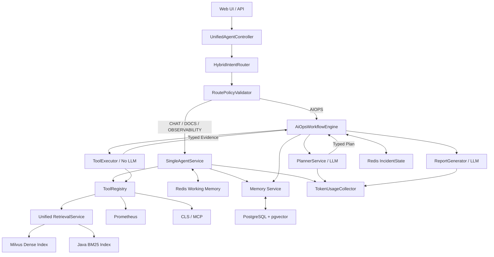

# SuperBizAgent 总体重构计划书

## 1. 项目定位

SuperBizAgent 是一个用于简历展示的企业智能运维 Agent 项目。重构目标不是实现完整生产平台，而是形成结构清晰、指标可量化、能够演示设计取舍的技术项目。

项目最终重点展示：

- 单 Agent 与多 Agent 的职责分离。
- Java 状态机控制的 Plan–Execute–Replan。
- 工具路由、工具预算和结构化证据。
- 单次问答及多 Agent 任务的 Token 可视化。
- Redis 短期记忆与 PostgreSQL 用户级长期/实体记忆。
- Dense、BM25、RRF、Rerank 的可视化评测对比。
- 检索和生成解耦。

## 2. 已确认的设计决策

1. 普通问答使用轻量单 Agent，多步骤排障使用多 Agent 工作流。
2. 多 Agent 不继续依靠 Supervisor Prompt 控制循环，改为 Java `AiOpsWorkflowEngine`。
3. Planner 使用 LLM，但不挂载执行工具。
4. ToolExecutor 默认不使用 LLM，确定性调用白名单工具。
5. ReportGenerator 使用 LLM，根据 Typed Evidence 生成报告。
6. 每次模型调用统计 `inputTokens`、`outputTokens` 和 `totalTokens`。
7. 短期对话记忆存 Redis。
8. 长期记忆和实体记忆按用户隔离，存 PostgreSQL。
9. PostgreSQL 安装 pgvector，用于长期记忆语义检索。
10. Agent 生成的长期记忆先进入候选区，经过人工或系统验证后生效。
11. 企业知识库继续存 Milvus，不与用户记忆混在同一个 collection。
12. RAG 优化先建设评测模式，再实现 BM25、RRF 和 Rerank。
13. Reranker 主线继续使用 `gte-rerank-v2`。
14. 删除自定义关键词加权评分；Rerank 失败时回退到 RRF 排名。
15. 暂不把 BGE 本地部署、Elasticsearch、大规模多租户作为主线任务。

## 3. 总体架构

## 4. 三个执行任务

| 任务 | 目标 | 主要产出 |
| --- | --- | --- |
| 任务一 | 单 Agent 与多 Agent 优化 | 混合路由、代码状态机、Typed Plan/Evidence、Token 可视化 |
| 任务二 | 记忆与上下文优化 | Redis 短期记忆、PostgreSQL 长期/实体记忆、pgvector 检索 |
| 任务三 | RAG 评测与优化 | 评测平台、BM25、RRF、gte Rerank、检索/生成解耦 |

详细任务：

- [任务一：单 Agent 与多 Agent 优化](./01-单Agent与多Agent优化任务.md)
- [任务二：记忆与上下文优化](./02-记忆与上下文优化任务.md)
- [任务三：RAG 评测与优化](./03-RAG评测与优化任务.md)

## 5. 推荐执行顺序

### 阶段 A：可观测基础

先完成 Token 统计、统一响应结构和基础调用 Trace。后续所有 Agent/RAG 优化才能比较成本与延迟。

### 阶段 B：Agent 执行链路

重构单 Agent 服务边界；建立多 Agent Java 状态机；让 `/api/ai_ops` 接收用户任务。

### 阶段 C：RAG 评测与检索

先完成评测集和四种模式，再加入 BM25、RRF 和 gte Rerank，生成真实指标。

### 阶段 D：记忆与上下文

接入 Redis、PostgreSQL 和 pgvector，通过 Token 预算控制记忆进入 Prompt 的数量。

### 阶段 E：统一演示页面

前端展示：

- 单次问答 Token。
- 多 Agent 任务步骤、工具结果和累计 Token。
- 短期、长期、实体记忆来源。
- RAG 四种检索模式指标和单 Case 排名对比。

## 6. 非目标

本轮不要求：

- 自动执行生产修复操作。
- 完整 RBAC、多租户计费和审计平台。
- Elasticsearch/OpenSearch 集群。
- BGE Reranker 本地推理服务。
- 十万级文档压测。
- 分布式任务调度。
- 完整在线 A/B Test。

## 7. 总体验收标准

1. 普通问题和 AIOps 任务能够稳定进入正确链路。
2. 多 Agent 循环、失败次数、工具次数和 Token 预算由代码控制。
3. ToolExecutor 不依赖 LLM 自主决策。
4. 所有模型调用均能显示 Token；无法获得精确值时明确标注估算。
5. 短期记忆重启后可恢复，长期和实体记忆支持用户隔离、来源与验证状态。
6. RAG 提供 Dense、BM25、Hybrid、Hybrid+Rerank 四种可比较模式。
7. 评测页面展示 Hit@K、MRR、nDCG、无答案准确率和 P95 延迟。
8. 简历中的所有效果数字均来自保存的评测结果，而不是人工估计。

## 8. 简历表述模板

> 基于 Spring Boot、Spring AI Alibaba、Milvus、Redis 与 PostgreSQL/pgvector 构建企业 AIOps Agent；将 Prompt 驱动的 Supervisor 流程重构为 Java 状态机控制的 Planner–Executor–Reporter，支持结构化证据、失败预算和 Token 可视化；构建 Dense、BM25、RRF 与 Cross-Encoder Rerank 的 RAG 离线评测体系，通过 Hit@K、MRR、nDCG 和 P95 延迟量化检索优化效果。

