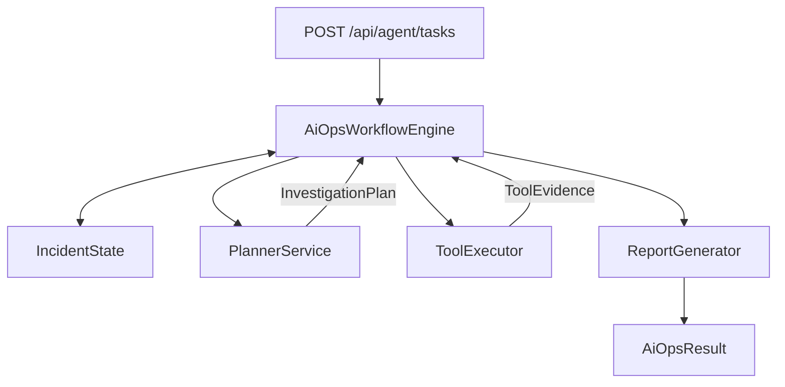

# 任务一：单 Agent 与多 Agent 优化

## 1. 任务目标

重构现有 `ChatService` 和 `AiOpsService`，形成：

- 有限工具预算的轻量单 Agent。
- Java 状态机控制的多 Agent AIOps 工作流。
- 统一的混合路由、工具注册、结构化证据和 Token 统计。

## 2. 当前主要问题

- Router 只使用关键词，不能可靠处理否定、同义表达和复杂意图。
- `PLAN / EXECUTE / FINISH` 只是 Prompt 文本约定。
- 连续失败 3 次没有代码计数器。
- 没有最大规划轮数、工具次数和 Token 预算。
- Planner 和 Executor 都挂载完整工具，角色隔离不严格。
- 最终报告依赖状态键 `planner_plan`。
- `/api/ai_ops` 不接收实际用户任务。
- 单次问答及多 Agent 每轮模型 Token 不可见。

## 3. 单 Agent 目标链路

```text
AgentRequest
→ HybridIntentRouter
→ RoutePolicyValidator
→ AgentContextBuilder
→ Single ReactAgent
→ 受限 ToolRegistry
→ AgentResponse + TokenUsage
```

单 Agent 适用：

- 普通聊天。
- RAG 文档问答。
- 一次性告警、日志或指标查询。
- 最多少量工具调用即可回答的问题。

建议默认预算：

```yaml
agent:
  single:
    max-tool-calls: 3
    max-model-calls: 4
    max-total-tokens: 12000
```

## 4. 混合路由

优先级：

```text
用户显式 mode
→ 当前工作流状态
→ 高精度规则
→ 模糊场景使用轻量 LLM 分类
→ 代码策略校验
```

```java
public record RouteDecision(
    AgentMode mode,
    Set<ToolCapability> capabilities,
    double confidence,
    boolean requiresClarification,
    RouteConstraints constraints,
    String reason
) {}
```

路由只提出能力建议，代码负责去除被用户禁止、无权限或超预算的工具。

## 5. 多 Agent 目标链路



### PlannerService

- 使用 LLM。
- 不挂载工具。
- 输入任务状态、已有证据、剩余预算和可用工具。
- 输出符合 Schema 的 Typed Plan。

```java
public enum PlannerDecision {
    EXECUTE,
    FINISH,
    ABORT,
    REQUIRE_HUMAN_INPUT
}
```

### ToolExecutor

- 默认不使用 LLM。
- 只执行 WorkflowEngine 已校验的单个步骤。
- 根据 `ToolType` 分发到白名单 Handler。
- 返回 Typed Evidence，不直接给出根因。

```java
public enum ToolType {
    QUERY_ALERTS,
    QUERY_METRICS,
    QUERY_LOGS,
    SEARCH_INTERNAL_DOCS,
    GET_CURRENT_TIME
}
```

### ReportGenerator

- 使用 LLM。
- 只读取 IncidentState 中的证据。
- 主要结论必须引用 Evidence ID。
- 证据不足时输出部分完成或无法确认。

## 6. IncidentState

```java
public class IncidentState {
    String taskId;
    String userRequest;
    WorkflowStatus status;
    InvestigationPlan currentPlan;
    List<InvestigationStep> steps;
    List<ToolEvidence> evidence;
    Map<ToolType, Integer> toolFailureCounts;
    Set<String> invocationFingerprints;
    int currentRound;
    int maxRounds;
    int totalToolCalls;
    int maxToolCalls;
    TokenUsageSummary tokenUsage;
    long maxTotalTokens;
    String terminationReason;
}
```

终止条件由代码判断：

- Planner 返回 FINISH 或 ABORT。
- 达到最大轮数。
- 达到最大工具次数。
- 达到 Token 预算并为报告保留 Token。
- 无可执行步骤。
- 用户取消任务。

## 7. Token 可视化

记录每次模型调用：

```java
public record ModelCallUsage(
    String callId,
    String requestId,
    String taskId,
    AgentStage stage,
    Integer round,
    String model,
    long inputTokens,
    long outputTokens,
    long totalTokens,
    UsageSource source,
    long durationMs
) {}
```

阶段：

```text
ROUTER
SINGLE_AGENT
PLANNER
EVIDENCE_SUMMARIZER
REPORTER
```

优先读取供应商 Usage Metadata；无法获取时使用估算并标记 `ESTIMATED`。

单 Agent SSE：

```text
content → content → usage → done
```

多 Agent SSE：

```text
task_created
plan
usage
step_started
tool_result
usage
report
usage
done
```

## 8. 代码任务清单

### A1：统一请求和响应

- 新建 `AgentRequest`、`AgentResponse`、`AiOpsResult`。
- 让 AIOps API 接收 `userRequest`、预算和查询范围。
- 前端提交合法 JSON Body。

### A2：Token 基础设施

- 新建 `TokenUsageCollector`、`UsageExtractor`。
- 在 ChatModel 层统一拦截所有调用。
- 支持流式和非流式 Usage。
- 前端显示总量和阶段详情。

### A3：混合路由

- 提取 `RuleBasedRouter`。
- 增加结构化 `LlmIntentClassifier`。
- 新建 `RoutePolicyValidator`。
- 低置信请求澄清或安全降级。

### A4：单 Agent

- 提取 `SingleAgentService`。
- 路由结果决定工具集合。
- 增加模型、工具和 Token 预算。

### A5：多 Agent 状态机

- 新建 `AiOpsWorkflowEngine`。
- 定义 Typed Plan、Step、Evidence。
- Planner 移除全部执行工具。
- ToolExecutor 改为 Java Dispatcher。
- 最终结果不再读取固定 `planner_plan` 键。

### A6：工具条件注册

- Mock CLS Tool 使用 `@ConditionalOnProperty`。
- 真实 MCP Tool 在 mock=false 时注册。
- 防止 Mock 和真实工具同时暴露。

## 9. 测试与验收

- Router 对否定句、同义句和模糊句有测试。
- Planner 非法 JSON 能被拒绝或修复一次。
- 同参数失败不会无限重复。
- ToolExecutor 无法调用白名单外工具。
- 最大轮数、工具预算和 Token 预算均有测试。
- 单 Agent 总 Token 覆盖 ReactAgent 内部全部模型调用。
- 多 Agent 能展示每轮 Planner 和 Reporter Token。
- AIOps 报告引用的 Evidence ID 均存在。

## 10. 简历可展示点

- 将 Prompt 软编排重构为 Java 状态机。
- Planner、Executor 和 Reporter 职责隔离。
- Typed Plan/Evidence 提升可测试性和审计能力。
- Token、延迟、工具次数和任务预算可视化。

